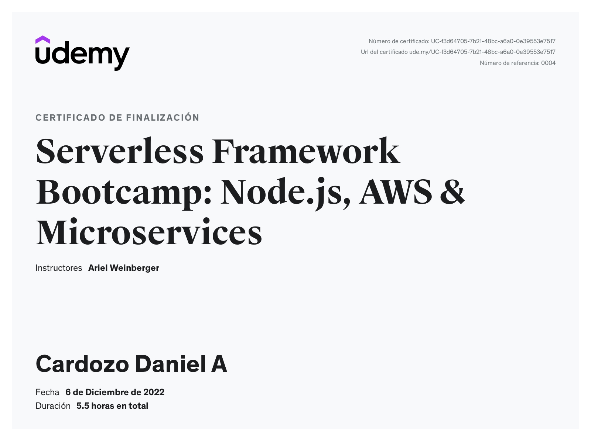
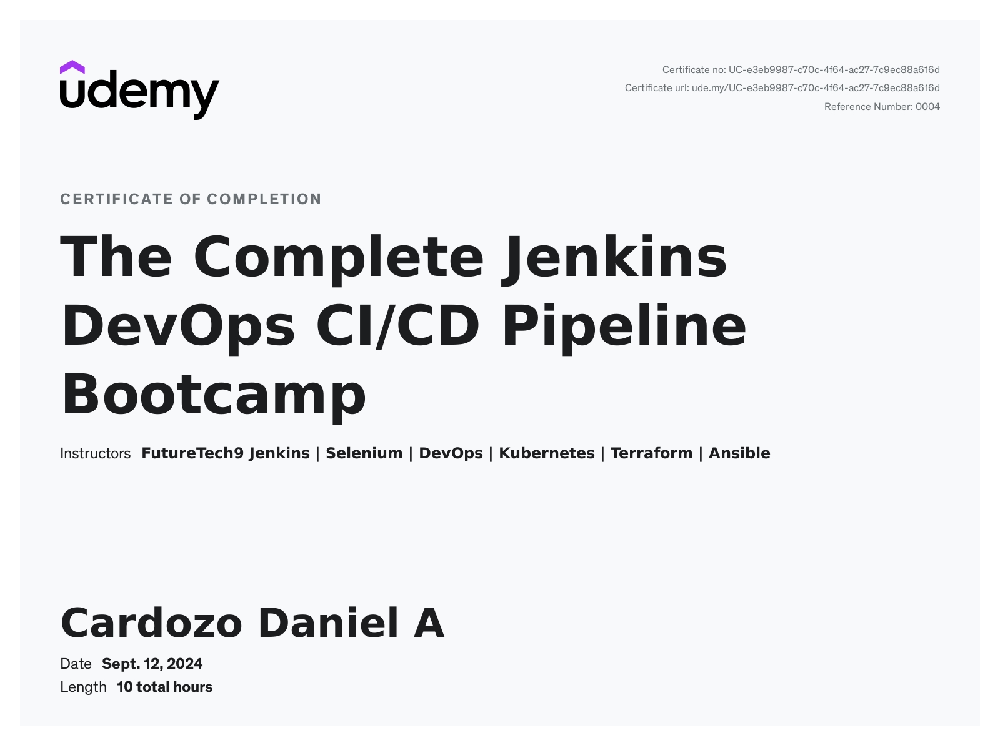
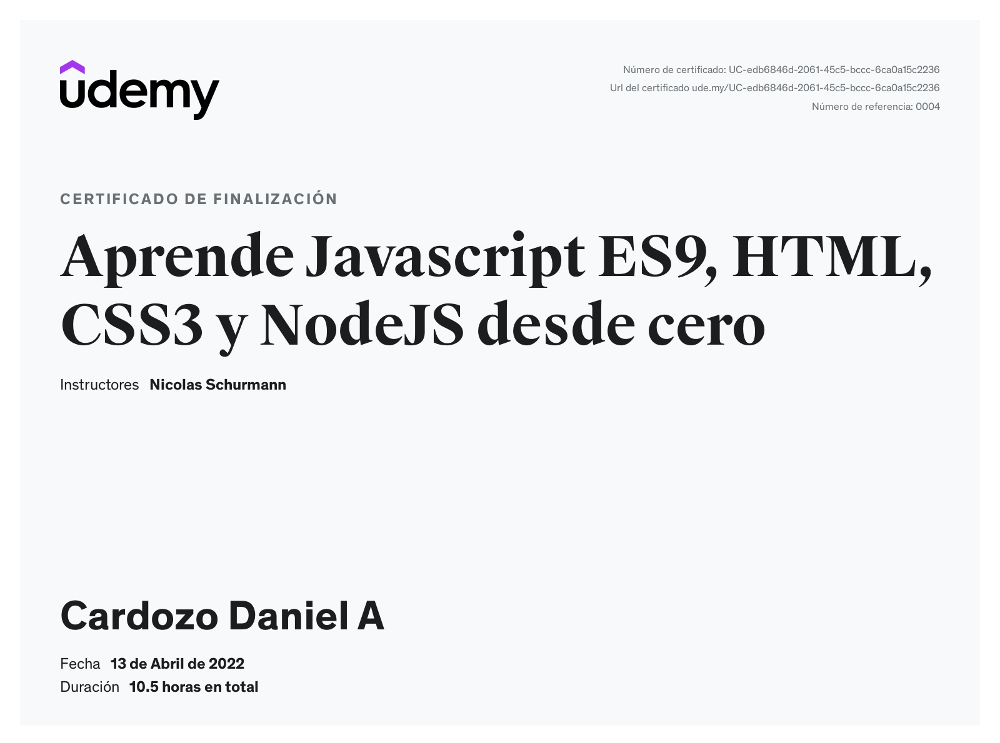
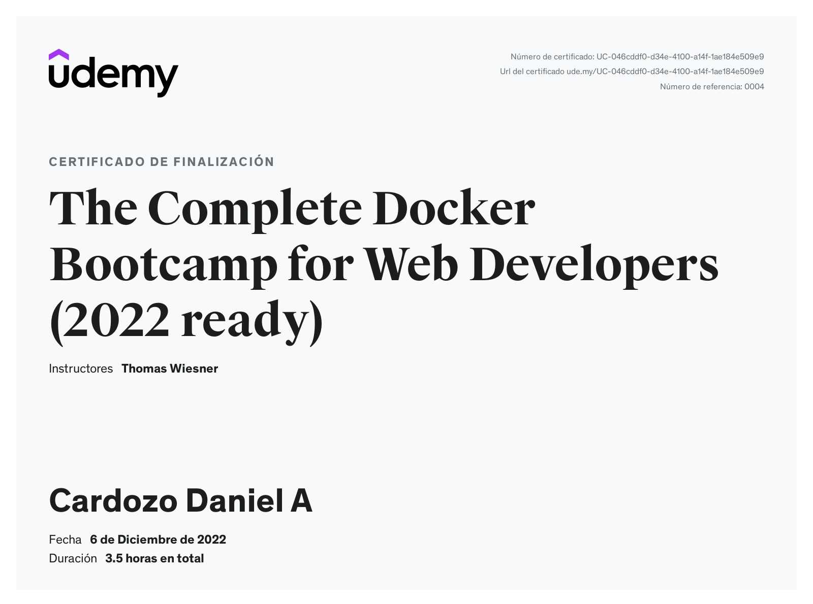
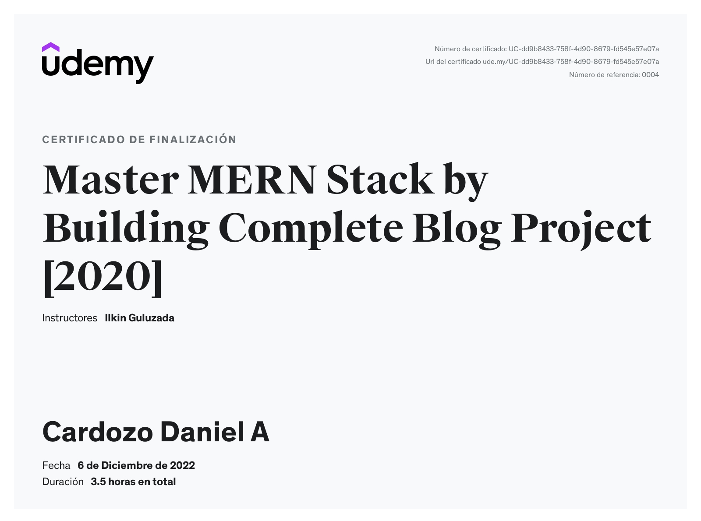
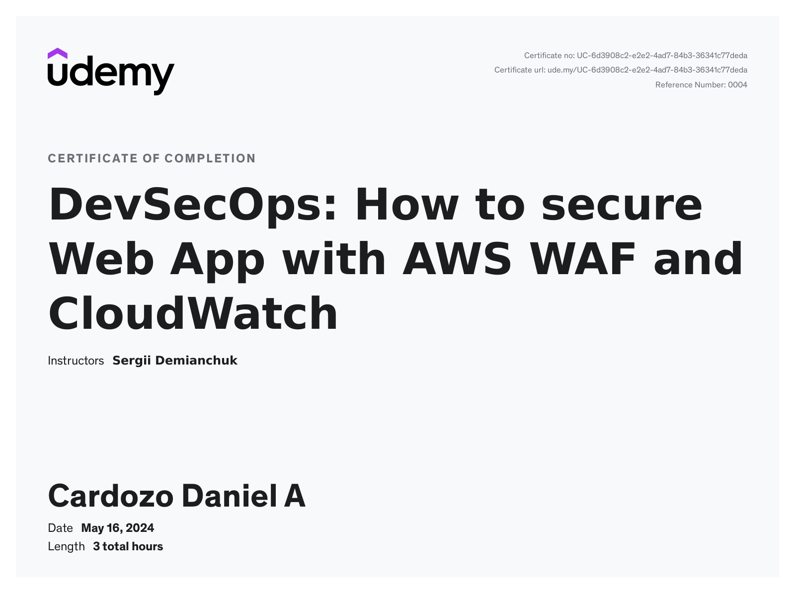

# Certificates & Courses

## Serverless Framework Bootcamp: Node.js, AWS & Microservices

## The Complete Jenkins DevOps CI/CD Pipeline Bootcamp

## NGINX, Apache, SSL Encryption - Certification Course

Aprende Javascript ES9, HTML, CSS3 y NodeJS desde cero

The Complete Docker Bootcamp for Web Developers

Master MERN Stack by Building Complete Blog Project

DevSecOps: How to secure Web App with AWS WAF and CloudWatch

